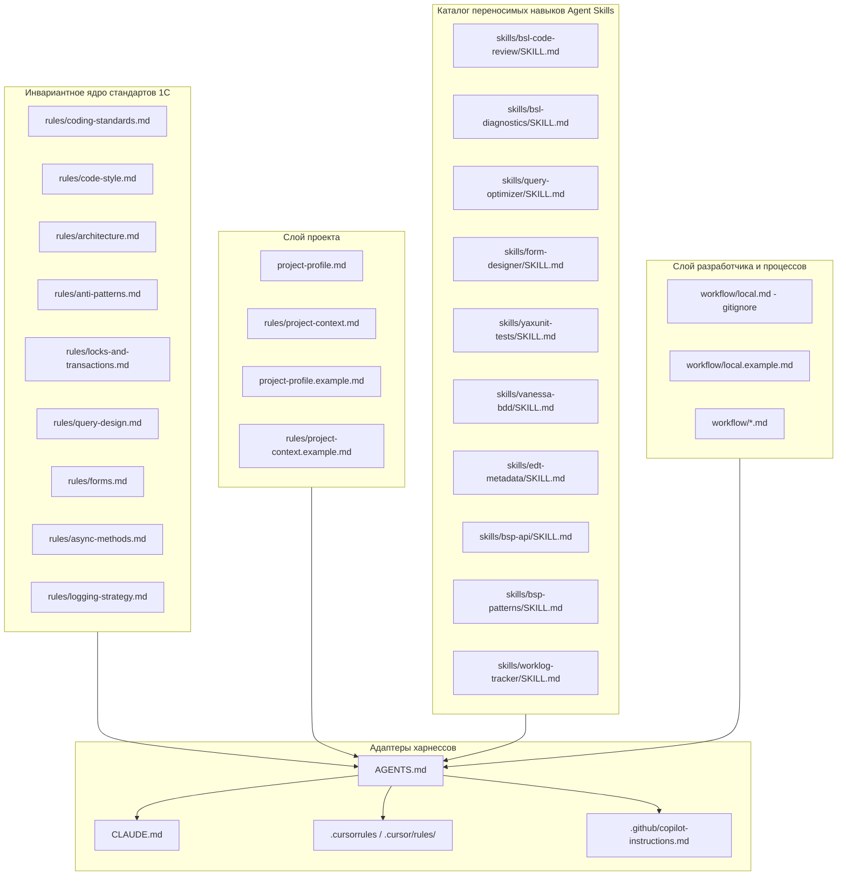

# ai-onec-toolkit: универсальный пакет правил, навыков и процессов разработки 1С

Универсальный модульный инструментарий для разработки на платформе 1С:Предприятие (BSL / EDT) с помощью ИИ-агентов. Написан в открытом стандарте Markdown, нейтрален к среде исполнения и готов к работе в Cursor, Claude Code, Codex, GitHub Copilot, Windsurf и Cline/Roo Code.

Входная точка для любого ИИ-агента - `AGENTS.md`.

---

## 1. Архитектура пакета

Пакет разделен на четыре слабосвязанных слоя:



### Состав файлов

| Раздел | Файлы | Назначение |
|---|---|---|
| **Главный роутер** | `AGENTS.md` | Единая точка входа: маршрутизация задач, правила открытия файлов, сводка запретов, список навыков |
| **Параметры проекта** | `project-profile.md`, `project-profile.example.md` | Версия платформы, префикс метаданных, наличие БСП, режим блокировок данных, формат исходников EDT |
| **Стандарты кода** | `rules/*.md` | Инвариантные правила разработки 1С (стиль, архитектура, запросы, формы, транзакции, антипаттерны) |
| **Зоны кода репозитория** | `rules/project-context.md`, `rules/project-context.example.md` | Разграничение типового, доработанного и стороннего кода, соглашения по тестам YAxUnit / Vanessa |
| **Руководство по внедрению** | `docs/adoption-guide.md` | Пошаговое руководство по встраиванию пакета в существующий проект (онбординг агентом и разработчиком) |
| **Каталог навыков** | `skills/<name>/SKILL.md` | Исполняемые сценарии (код-ревью, диагностика BSL LS, оптимизация запросов, формы, тесты, worklog) |
| **Процессы команды** | `workflow/*.md` | Модель ветвления Git, регламент код-ревью MR/PR, BSL Language Server, ведение заметок и ADR |
| **Локальные настройки** | `workflow/local.example.md` | Шаблон персонального конфига разработчика (worktree для ревью, хранилище заметок, роли MCP) |
| **Адаптеры харнессов** | `CLAUDE.md`, `.cursorrules`, `.cursor/rules/`, `.github/copilot-instructions.md` | Нативные файлы конфигурации для мгновенного подхвата правил различными агентами |
| **Конфиг линтера** | `.bsl-language-server.json` | Параметры статического анализа BSL Language Server с фильтрами исключений |

---

## 2. Быстрый старт за 3 шага

### Шаг 1. Копирование пакета в репозиторий
Скопируйте структуру пакета в корень вашего проекта 1С (конфигурации или расширения):
```text
your-project-root/
├── AGENTS.md
├── CLAUDE.md
├── .cursorrules
├── .cursor/rules/bsp-edt.mdc
├── .github/copilot-instructions.md
├── project-profile.md
├── project-profile.example.md
├── docs/
│   └── adoption-guide.md
├── rules/
├── skills/
├── workflow/
└── .bsl-language-server.json
```

> **Подробное руководство по внедрению:**  
> Детальный сценарий онбординга для работающего проекта силами ИИ-агента (с готовым стартовым промптом) и чек-лист ручного слияния файлов находятся в **[`docs/adoption-guide.md`](docs/adoption-guide.md)**.

### Шаг 2. Настройка профиля проекта и зон кода
1. Откройте `project-profile.md` и заполните параметры своей системы (ориентируясь на `project-profile.example.md`):
   - `{PLATFORM_VERSION}`: версия платформы (например, `8.3.24`, `8.3.27`);
   - `{PREFIX}`: проектный префикс объектов и реквизитов (например, `смк_`, `проект_` или оставьте пустым);
   - `{USES_BSP}`: использование БСП (`Да` / `Нет`);
   - `{LOCK_MODE}`: режим транзакционных блокировок (`Managed` / `Automatic`).
2. В файле `rules/project-context.md` опишите структуру каталогов репозитория и каталоги автотестов (шаблон заполнения - `rules/project-context.example.md`).

### Шаг 3. Активация агента и локальное окружение разработчика
1. **Адаптер харнесса:** агент автоматически применит инструкции из файла своей среды (`CLAUDE.md` для Claude Code, `.cursorrules` / `.cursor/rules/` для Cursor, `.github/copilot-instructions.md` для Copilot).
2. **Локальный файл разработчика:** скопируйте `workflow/local.example.md` в `workflow/local.md` (файл в `.gitignore`):
   - Укажите путь к рабочей копии `{РАБОЧАЯ_КОПИЯ}` и фиксированному каталогу для ревью `{REVIEW_WORKTREE}`.
   - Задайте провайдер хостинга (`gitlab`, `github`, `local`) и трекера задач (`jira`, `youtrack`, `kaiten`, `manual`).
   - Настройте хранилище заметок `{NOTES_STORAGE}` (папка в Obsidian, локальный каталог проекта или `none`).

---

## 3. Матрица совместимости харнессов

| Агент / Харнесс | Файл адаптера | Поддержка Agent Skills | MCP-интеграция | Особенности подключения |
|---|---|---|---|---|
| **Cursor** | `.cursorrules`, `.cursor/rules/bsp-edt.mdc` | Нативная (вызов через системный контекст и динамические инструменты) | Полная (MCP-серверы в пользовательском конфиге) | Автоматически подхватывает `AGENTS.md` и правила для файлов `*.bsl`, `*.os`, `*.mdo`, `*.xml` |
| **Claude Code** | `CLAUDE.md` | Нативная (`skills/<name>/SKILL.md`) | Полная (`.mcp.json`, CLI) | Подключает `@AGENTS.md`, регистрирует навыки каталога `skills/` |
| **GitHub Copilot / Codex** | `.github/copilot-instructions.md` | Через чтение инструкций в промпте | Базовая / CLI | Ссылается на стандарты `AGENTS.md` и параметры `project-profile.md` |
| **Windsurf** | `AGENTS.md` | Через чтение инструкций | Полная (MCP) | Достаточно указать `AGENTS.md` в правилах Cascade |
| **Cline / Roo Code** | `AGENTS.md` | Через чтение каталога `skills/` | Полная (MCP) | Добавить ссылку на `AGENTS.md` в `.roomodes` или системный промпт |

---

## 4. Каталог навыков (Agent Skills)

Все навыки спроектированы в открытом переносимом стандарте `skills/<name>/SKILL.md`:

| Навык | Директория | Что делает |
|---|---|---|
| **`bsl-code-review`** | `skills/bsl-code-review/SKILL.md` | Комплексное код-ревью модулей 1С и diff изменений MR/PR. Анализ антипаттернов, классификация (CRITICAL, HIGH, MEDIUM, LOW), расчет Confidence Score (0-100%) и примеры «было/стало» |
| **`bsl-diagnostics`** | `skills/bsl-diagnostics/SKILL.md` | Запуск статического анализа линтером BSL Language Server (через MCP или CLI), фильтрация по измененным строкам diff, игнорирование сторонних библиотек |
| **`query-optimizer`** | `skills/query-optimizer/SKILL.md` | Аудит и рефакторинг запросов 1С: устранение запросов в циклах, перевод подзапросов в проиндексированные временные таблицы, фильтрация ВТ в параметрах, очистка tempdb (`УНИЧТОЖИТЬ`) |
| **`form-designer`** | `skills/form-designer/SKILL.md` | Проектирование эргономичной раскладки управляемых форм, программная модификация элементов и реквизитов в `ПриСозданииНаСервере`, канонические области `Form.Module.bsl` |
| **`yaxunit-tests`** | `skills/yaxunit-tests/SKILL.md` | Создание модульных и интеграционных тестов на YAxUnit: регистрация в `ИсполняемыеСценарии()`, изолированное выполнение `ВТранзакции()`, метод AAA, фабрики тестовых данных |
| **`vanessa-bdd`** | `skills/vanessa-bdd/SKILL.md` | Разработка BDD-сценариев Vanessa Automation на языке Gherkin (*.feature): офлайн-база из 1569 шагов, семантический поиск шагов по смыслу, валидатор готовых фич (`validate.py`) |
| **`edt-metadata`** | `skills/edt-metadata/SKILL.md` | Создание и правка метаданных EDT (*.mdo, Form.form): проверка глобальной уникальности UUID (автоматический скрипт `check_uuid_duplicates.py`), целостность ссылок, ресурсы регистров |
| **`bsp-api`** | `skills/bsp-api/SKILL.md` | Справочник программного интерфейса БСП (2624 метода, 284 модуля): поиск методов, сигнатур, контекстов исполнения (клиент/сервер), валидация вызовов через CLI `bsp-api.py check` |
| **`bsp-patterns`** | `skills/bsp-patterns/SKILL.md` | Прикладные архитектурные сценарии БСП (38 тем): длительные операции, печать, фоновые задания, версионирование, обмен данными, безопасный режим, права доступа |
| **`worklog-tracker`** | `skills/worklog-tracker/SKILL.md` | Автоматизация артефактов разработчика: предварительный анализ задачи (`analyse/`), сквозной накопительный журнал сессий (`worklog/`) с оценкой времени и архитектурные решения (ADR) |

---

## 5. Ролевая модель MCP, настройка окружения и автономная работа

Взаимодействие с внешними инструментами построено на принципах **Capability-based Tooling**. Названия инструментов не зашиваются жестко в код, а маппятся на 5 функциональных ролей в `workflow/local.md`:

| Функциональная роль | Инструменты | Назначение | Поведение при отсутствии MCP |
|---|---|---|---|
| `bsl-diagnostics` | BSL LS `analyze_file` | Статический анализ BSL / OneScript | Запуск BSL LS через CLI (`bsl-language-server analyze`) или ручной аудит по `rules/coding-standards.md` |
| `metadata-provider` | Плагины EDT / 1C | Получение состава реквизитов и типов | Чтение дескрипторов метаданных `*.mdo` и `Configuration.mdo` из файлов проекта |
| `platform-docs` | Справочные сервисы 1С | Синтакс-помощник и справка по платформе | Документация 1С ИТС и учет режима совместимости `{PLATFORM_VERSION}` |
| `git-host` | GitLab / GitHub MCP | Получение diff, управление MR/PR | Консольный `git` (`git diff`, `git checkout`), вывод отчетов в Markdown |
| `task-tracker` | Jira / YouTrack / Kaiten | Загрузка описания задачи и критериев приемки | Получение требований из текста запроса пользователя |

### Пример настройки MCP-серверов

Для подключения BSL Language Server в конфигурации MCP-серверов (например, `.cursor/mcp.json` в Cursor или `.mcp.json` в Claude Code):

```json
{
  "mcpServers": {
    "bsl-language-server": {
      "command": "java",
      "args": [
        "-jar",
        "/path/to/bsl-language-server.jar",
        "--stdio"
      ],
      "env": {
        "JAVA_HOME": "/path/to/jdk-17"
      }
    }
  }
}
```

### Переменные окружения и локальная конфигурация

При использовании интеграций с Git-хостингом и трекерами задач задаются стандартные переменные окружения (в `.env` или локальной среде):
- `GITLAB_TOKEN` / `GITHUB_TOKEN` - доступ к API репозитория и чтению diff / созданию комментариев к MR/PR.
- `JIRA_API_TOKEN` / `YOUTRACK_TOKEN` - доступ к трекеру задач для получения критериев приемки.
- `JAVA_HOME` - путь к JRE/JDK 17+ для запуска BSL Language Server.

> **Автономность:** При отсутствии в среде любых MCP-серверов агент не останавливает работу, а полноценно выполняет задачу на основе исходного кода проекта и документации платформы. В итоговом отчете агент явно фиксирует факт отсутствия автоматического анализатора.

---

## 6. Базовые принципы и допущения

1. **Библиотека Стандартных Подсистем (БСП):**  
   Если `{USES_BSP} = Да`, правила требуют обращения к реквизитам через функции БСП `ОбщегоНазначения.ЗначениеРеквизитаОбъекта*`, использования подсистемы длительных операций и строковых функций. Прямое обращение через точку к реквизитам ссылочных типов на сервере запрещено.
2. **Правила строже стандартов ИТС:**  
   Ряд правил проекта намеренно строже официальных стандартов фирмы «1С» (запрет тернарного оператора `?(...)`, обязательная промежуточная переменная для `Запрос.Выполнить()`, обязательное `ИНДЕКСИРОВАТЬ ПО` для временных таблиц, запрет буквы «ё» и длинных тире «—»). Такие правила помечены тегом `[Правило проекта - строже стандарта ИТС]`.
3. **Неприкосновенность типового кода:**  
   Код поставщика изменяется строго в рамках бизнес-требований задачи. Рефакторинг, исправление форматирования и переименование переменных в типовых модулях строго запрещены.
