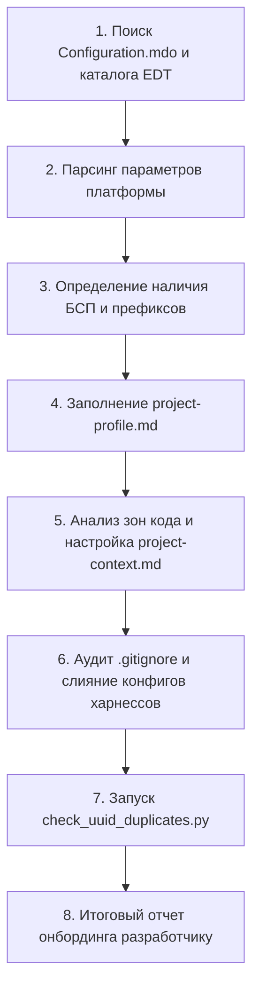

# Руководство по встраиванию ai-onec-toolkit в существующий проект 1С

Настоящее руководство регламентирует процесс интеграции пакета правил, навыков и процессов **ai-onec-toolkit** в уже существующий (боевой) репозиторий 1С:Предприятие (EDT / BSL).

Руководство разделено на две части:
1. **Онбординг силами ИИ-агента** (рекомендуемый быстрый способ: агент исследует исходники EDT и автоматически заполняет профиль и контекст).
2. **Ручной онбординг разработчиком** (пошаговая настройка параметров, слияние конфигурационных файлов и проверка окружения).

---

## 1. Способы добавления пакета в Git-репозиторий проекта

Выберите один из вариантов подключения пакета к вашему репозиторию:

### Вариант A. Прямое копирование (рекомендуется для большинства проектов)

Скопируйте структуру пакета в корень репозитория вашего проекта:
```text
your-project-root/
├── AGENTS.md
├── CLAUDE.md
├── .cursorrules
├── .cursor/rules/bsp-edt.mdc
├── .github/copilot-instructions.md
├── project-profile.md
├── project-profile.example.md
├── docs/
│   └── adoption-guide.md
├── rules/
├── skills/
├── workflow/
└── .bsl-language-server.json
```

Преимущество: простота, отсутствие сторонних зависимостей в Git, возможность точечной адаптации любых правил под стандарты команды.

### Вариант B. Подключение через `git subtree` (для централизованных обновлений)

Если вы хотите получать обновления пакета из центрального репозитория toolkit:
```bash
# Добавление удаленного репозитория toolkit
git remote add toolkit-upstream <URL_РЕПОЗИТОРИЯ_AI_ONEC_TOOLKIT>

# Вливание ветки пакета в подкаталог или корень
git subtree add --prefix=. toolkit-upstream master --squash
```

---

## 2. Онбординг силами ИИ-агента (Автоматический сценарий)

Наиболее быстрый и безошибочный путь — поручить первичный аудит и адаптацию профиля самому ИИ-агенту (Cursor, Claude Code, Windsurf или Copilot).

### Стартовый промпт для ИИ-агента

Скопируйте и отправьте агенту следующий промпт в корне вашего проекта:

```text
Я подключил в наш проект пакет ai-onec-toolkit. 
Выполни автоматический онбординг пакета под текущий репозиторий 1С:

1. Исследуй дерево проекта и найди корневой файл конфигурации (Configuration.mdo).
2. Определи ключевые параметры платформы и запиши их в project-profile.md:
   - Версию режима совместимости платформы (compatibilityMode);
   - Режим управления блокировками данных (dataLockControlMode);
   - Наличие Библиотеки Стандартных Подсистем (БСП) по составу общих модулей;
   - Расположение каталога исходников EDT ({EDT_PROJECT_FORMAT});
   - Проектные префиксы метаданных ({PREFIX}), проанализировав имена подсистем, 
     справочников и документов.
3. Опиши зоны кода в rules/project-context.md:
   - Укажи каталоги основной конфигурации, расширений и тестов;
   - Зафиксируй правила неприкосновенности типового кода вендора.
4. Проверь конфигурацию .gitignore:
   - Убедись, что служебные папки (ParentConfigurations, .scannerwork, workflow/local.md) 
     надежно исключены.
5. Запусти скрипт проверки дубликатов UUID метаданных:
   python skills/edt-metadata/scripts/check_uuid_duplicates.py <каталог-исходников>
6. Выведи отчет онбординга: что определено автоматически, какие параметры требуют 
   ручного подтверждения и статус проверки UUID.
```

### Протокол действий агента при онбординге

При получении команды агент действует по следующему строгому протоколу:



1. **Определение корня исходников EDT:**
   - Поиск файла `Configuration.mdo`.
   - Каталог, в котором он находится, определяет значение `{EDT_PROJECT_FORMAT}` (обычно `src/cf/src`, `src/configuration` или `cf/src`).
2. **Анализ метаданных `Configuration.mdo`:**
   - Свойство `compatibilityMode`: определяет `{PLATFORM_VERSION}` (например, `Version8_3_24` -> `8.3.24`). Если режим совместимости не используется — берется версия формата выгрузки.
   - Свойство `dataLockControlMode`: `Managed` -> `Managed`, `Automatic` -> `Automatic`.
   - Модули БСП: поиск общих модулей `ОбщегоНазначения`, `ОбщегоНазначенияКлиентСервер`. Если найдены — `{USES_BSP} = Да`.
3. **Выявление проектных префиксов (`{PREFIX}`):**
   - Анализ имен нетиповых подсистем, справочников и документов.
   - Если большинство доработанных объектов начинается на `смк_`, `мп_`, `ит_`, `проект_` — префикс заносится в `{PREFIX}`. Если конфигурация полностью оригинальная или префикс отсутствует — параметр остается пустым.
4. **Анализ окружения тестирования:**
   - Поиск каталогов `yaxunit/`, `tests/` или упоминаний `ЮТтесты` в коде -> добавление `YAxUnit` в `{TEST_FRAMEWORKS}`.
   - Поиск каталогов `tests/bdd/`, `features/` или файлов `*.feature` -> добавление `Vanessa Automation` в `{TEST_FRAMEWORKS}`.
5. **Фиксация в файлах проекта:**
   - Запись параметров в `project-profile.md`.
   - Заполнение карты репозитория в `rules/project-context.md`.
   - Запуск проверки дубликатов UUID через `skills/edt-metadata/scripts/check_uuid_duplicates.py`.

---

## 3. Ручной онбординг разработчиком (Пошаговый сценарий)

Если вы настраиваете проект вручную без помощи ИИ, выполните следующие шаги:

### Шаг 1. Настройка параметров проекта (`project-profile.md`)

Откройте `project-profile.md` и заполните таблицу параметров (ориентируясь на образцы из `project-profile.example.md`):

```markdown
| Параметр | Значение | Назначение |
|---|---|---|
| `{PREFIX}` | `смк_` | Префикс ваших доработок (или оставьте пустым, если префикс не используется) |
| `{PLATFORM_VERSION}` | `8.3.24` | Режим совместимости конфигурации (определяет доступность Асинх/Ждать) |
| `{EDT_PROJECT_FORMAT}` | `src/cf/src` | Путь к папке исходников, содержащей Configuration.mdo |
| `{CONFIGURATION_TYPE}` | `ERP` | Тип основы: ERP, КА, УТ, БП, ЗУП, УНФ или Самописная |
| `{USES_BSP}` | `Да` | Использование БСП (Да / Нет) |
| `{LOCK_MODE}` | `Managed` | Режим блокировок (Managed / Automatic) |
| `{TEST_FRAMEWORKS}` | `YAxUnit, Vanessa Automation` | Инструменты тестирования или Отсутствуют |
| `{NEW_OBJECTS_IN}` | `main_configuration` | Где создавать новые объекты: main_configuration или extension |
```

### Шаг 2. Разметка зон кода (`rules/project-context.md`)

В файле `rules/project-context.md` определите карту путей репозитория:
1. **Основная конфигурация:** путь к исходникам EDT.
2. **Расширения:** пути к проектным расширениям (если используются).
3. **Тесты:** каталоги юнит-тестов YAxUnit и BDD-сценариев Vanessa Automation.
4. **Правила границ:** явно укажите, какие префиксы и каталоги считаются кодом вендора (не подлежат рефакторингу), а какие — проектным кодом команды.

### Шаг 3. Слияние конфигурационных файлов проекта

Если в вашем репозитории уже существовали конфигурационные файлы, выполните аккуратное слияние:

#### 1. `.gitignore`
Добавьте в существующий `.gitignore` секции из пакета toolkit:
```gitignore
# Персональные параметры разработчика
workflow/local.md
*.local.md

# Локальные каталоги агентов и IDE
.cursor/*
!.cursor/rules/
.claude/
.mcp.json

# Исходники родительской конфигурации поставщика EDT
**/ParentConfigurations*/
**/ParentConfigurations/**

# Служебные артефакты тестов и анализаторов
.scannerwork/
.sonar/
tools/syntax-check/exceptionFile.txt
tests/json/
allure-results/
```

#### 2. Инструкции агентов (`CLAUDE.md`, `.cursorrules`, `.github/copilot-instructions.md`)
- Если у вас уже есть `CLAUDE.md`: сохраните свои специфичные команды проекта (сборка, деплой) в начале файла, а ниже подключите ссылку на `@AGENTS.md` и перечень навыков из шаблона пакета.
- Если у вас уже есть `.cursorrules`: объедините секции, гарантируя наличие правил из корневого `.cursorrules` пакета.

### Шаг 4. Настройка локального окружения разработчика (`workflow/local.md`)

Скопируйте `workflow/local.example.md` в `workflow/local.md` (файл находится в `.gitignore`):
```bash
cp workflow/local.example.md workflow/local.md
```
Заполните параметры вашей локальной рабочей станции:
* `{РАБОЧАЯ_КОПИЯ}` — абсолютный путь к папке репозитория на диске.
* `{REVIEW_WORKTREE}` — путь к изолированному git worktree для проведения ревью (чтобы переключение веток не сбрасывало незакоммиченные файлы и прогретый кэш BSL LS).
* `{GIT_PROVIDER}` — `gitlab`, `github` или `local`.
* `{TASK_PROVIDER}` — `jira`, `youtrack`, `kaiten` или `manual`.
* `{NOTES_STORAGE}` — путь к Obsidian-хранилищу или `none`.

---

## 4. Верификация целостности после внедрения

После копирования и настройки файлов запустите базовые проверки:

### 1. Проверка уникальности UUID в метаданных EDT
Запустите валидатор дубликатов UUID по исходникам конфигурации:
```bash
python skills/edt-metadata/scripts/check_uuid_duplicates.py <путь-к-исходникам-EDT>
```
*Критерий успеха:* сообщение `OK - дубликатов не найдено`. При наличии коллизий UUID запустите исправление с флагом `--fix`.

### 2. Проверка инструментария БСП
Проверьте работу локального валидатора вызовов БСП:
```bash
python skills/bsp-api/scripts/bsp-api.py check ОбщегоНазначения.ЗначениеРеквизитаОбъекта
```
*Критерий успеха:* скрипт возвращает сигнатуру метода и статус `есть`.

### 3. Проверка инструментария Vanessa BDD (если используется)
Проверьте семантический поиск по реестру шагов:
```bash
python skills/vanessa-bdd/scripts/search_steps.py --query "открыть форму документа" --top 3
```
*Критерий успеха:* вывод релевантных шагов из библиотеки.

---

## 5. Первый рабочий сценарий (Smoke Test)

Чтобы убедиться, что ИИ-агент подхватил правила и навыки проекта:

1. Откройте чат с агентом (в Cursor, Claude Code или Copilot).
2. Задайте контрольный вопрос:
   > *«Какие стандарты проекта действуют при обращении к реквизитам ссылочных объектов на сервере и какой префикс метаданных настроен в нашем профиле?»*
3. **Ожидаемый ответ:** агент считывает параметры из `project-profile.md` и `rules/code-style.md`, называет установленный `{PREFIX}` и указывает на обязательное использование функций БСП `ОбщегоНазначения.ЗначениеРеквизитаОбъекта*` вместо обращения через точку.
