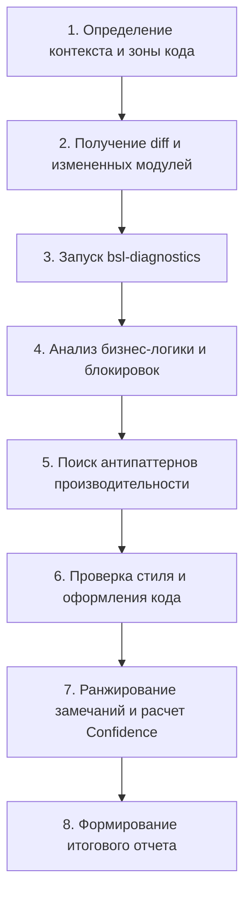

# Код-ревью модулей 1С (BSL)

Скилл регламентирует проведение всестороннего статического анализа и код-ревью модулей 1С:Предприятие (BSL) как для отдельных файлов, так и для diff в Merge Request / Pull Request.

---

## 1. Входные данные и предварительные требования

Перед началом ревью агент обязан определить контекст:

1. **Параметры проекта из `project-profile.md`:**
   - Префикс проекта: `{PREFIX}` (если не задан - новые объекты и реквизиты могут быть без префикса).
   - Версия платформы: `{PLATFORM_VERSION}` (определяет допустимость синтаксиса `Асинх` / `Ждать`).
   - Наличие БСП: `{USES_BSP}` (`Да` / `Нет`).
   - Режим управления блокировками: `{LOCK_MODE}` (`Managed` / `Automatic`).
2. **Зона изменяемого кода по `rules/project-context.md`:**
   - **Типовой код:** править минимально, форматирование не менять, рефакторинг запрещен.
   - **Проектный код:** полные стандарты проекта.
   - **Сторонние библиотеки и тестовые движки:** замечания линтера и код-ревью **не выставляются**.
   - **Проектные тесты:** соблюдение структуры YAxUnit / Vanessa.
3. **Изоляция рабочего каталога:**
   - При ревью MR/PR проверка выполняется в выделенном worktree (`{REVIEW_WORKTREE}`), чтобы не засорять активную рабочую копию разработчика. См. `workflow/code-review.md`.

---

## 2. Пошаговый сценарий проведения ревью



### Шаг 1. Получение изменений и контекста задачи
- Получить список измененных файлов и diff (через Git-хостинг или `git diff`).
- Сопоставить изменения с требованиями тикета (роль `task-tracker` по `workflow/code-review.md`): решает ли код бизнес-задачу без избыточных правок?

### Шаг 2. Автоматическая диагностика линтера
- Вызвать скилл `bsl-diagnostics` для анализа измененных файлов BSL.
- Оставить только диагностики, приходящиеся на измененные или добавленные строки diff.

### Шаг 3. Проверка транзакций и блокировок (`rules/locks-and-transactions.md`)
- **Управляемые блокировки (`{LOCK_MODE} = Managed`):**
  - При записи наборов записей регистров в транзакции установлена ли явная блокировка (`БлокировкаДанных`)?
  - Блокировка устанавливается **до** чтения данных, по которым принимается решение о записи.
  - Пространство блокировок заполнено максимально точно (по всем ключевым измерениям: Организация, Номенклатура, Склад).
- **Длительность транзакций:**
  - Внутри транзакций отсутствуют обращения к внешним системам (HTTP/WS), диалоги с пользователем (`Вопрос`, `Предупреждение`) и длительные неоптимальные расчеты.

### Шаг 4. Обнаружение критических антипаттернов (`rules/anti-patterns.md`, `rules/query-design.md`)
- **Запросы в циклах (CRITICAL):**
  - Любой вызов `Запрос.Выполнить()` или поиск в БД внутри цикла `Для`, `Для Каждого`, `Пока` должен быть вынесен в единый пакетный запрос с передачей массива ссылок через параметр.
- **Прямое обращение через точку к реквизитам ссылок (CRITICAL при `{USES_BSP} = Да`):**
  - Запрещено: `Контрагент.ИНН`, `Номенклатура.Артикул` на сервере.
  - Требуется: `ОбщегоНазначения.ЗначениеРеквизитаОбъекта(Ссылка, "ИмяРеквизита")` или пакетное получение через `ОбщегоНазначения.ЗначенияРеквизитовОбъекта()`.
- **Подзапросы в списке полей выборки (CRITICAL):**
  - Подзапрос вида `(ВЫБРАТЬ ... ИЗ ... ГДЕ ...) КАК Поле` приводит к выполнению N+1 на уровне СУБД. Обязателен перевод в левое соединение со сгруппированной временной таблицей.
- **Фильтрация виртуальных таблиц в секции `ГДЕ` (HIGH):**
  - Условия по измерениям и периоду должны передаваться в параметрах виртуальной таблицы (`РегистрНакопления.Остатки(&Период, Номенклатура = &Номенклатура)`), а не в блоке `ГДЕ`.
- **Непроиндексированные временные таблицы (HIGH):**
  - Каждая таблица `ВТ_*`, участвующая далее в `СОЕДИНЕНИЕ` или `В (ВЫБРАТЬ ...)`, должна содержать секцию `ИНДЕКСИРОВАТЬ ПО` по полям соединения (2-3 селективных поля).
- **Избыточный `РАЗЛИЧНЫЕ` (MEDIUM):**
  - Использование `РАЗЛИЧНЫЕ` поверх `СГРУППИРОВАТЬ ПО` или внутри блоков `ОБЪЕДИНИТЬ` приводит к двойной сортировке в tempdb. Заменять на `ОБЪЕДИНИТЬ ВСЕ` там, где дубли исключены алгоритмически.

### Шаг 5. Стандарты оформления и чистоты кода (`rules/code-style.md`, `rules/module-structure.md`, `rules/metadata-naming.md`)
- **Именование и префиксы (`{PREFIX}`):**
  - Новые объекты метаданных, реквизиты типовых объектов, элементы типовых форм и роли должны содержать префикс `{PREFIX}` из `project-profile.md` (см. `rules/metadata-naming.md`).
  - Если `{PREFIX}` в профиле пуст, создание без префикса допустимо.
  - Внутри собственных проектных объектов (уже имеющих префикс) реквизиты именуются **без** повторного префикса.
- **Асинхронные методы (`rules/async-methods.md`):**
  - Допустимость синтаксиса `Асинх` / `Ждать` определяется параметром `{PLATFORM_VERSION}` (доступно с 8.3.18).
  - Внимание к расширениям: режим совместимости расширения может быть ниже 8.3.18, тогда используются `ОписаниеОповещения` и `Показать*`.
- **Запрещенные конструкции:**
  - Тернарный оператор `?(...)` -> заменять на явный `Если ... Тогда ... Иначе ... КонецЕсли`.
  - Динамическое выполнение `Выполнить()`, `Вычислить()` без обоснования.
  - Прямой вывод `Сообщить()` в прикладном коде -> `ОбщегоНазначения.СообщитьПользователю()`.
  - Сравнение булевых переменных с `Истина` / `Ложь` (например, `Если Флаг = Истина Тогда`).
  - Yoda-синтаксис (`Если 5 = Количество Тогда`).
  - Символы буквы «ё» и длинные тире «—» в BSL-коде и текстах сообщений.
  - `Попытка...Исключение` вокруг чтения и записи в БД без явного обоснования.
- **Канонические области модуля (`#Область`):**
  - Проверить наличие стандартных областей (`ПрограммныйИнтерфейс`, `СлужебныйПрограммныйИнтерфейс`, `СлужебныеПроцедурыИФункции` для общих модулей; 5 областей для форм).
  - Проверить отсутствие вложенных областей внутри тел процедур и функций.

---

## 3. Матрица классификации замечаний

Каждое замечание классифицируется по уровню критичности и снабжается оценкой достоверности (**Confidence Score**):

| Уровень | Критерий | Блокирует MR? | Примеры |
|---|---|---|---|
| **CRITICAL** | Падение в рантайме, уязвимости, взаимные блокировки, деградация производительности СУБД O(N) | **Да** (`[blocking]`) | Запрос в цикле, транзакция без блокировки в Managed Lock, неперехваченное исключение в фоновом задании |
| **HIGH** | Нарушение архитектурных стандартов проекта, отсутствие индексов ВТ, утечки памяти | **Да** (`[blocking]`) | Обращение через точку от ссылки при БСП, фильтр виртуальной таблицы в `ГДЕ`, обращение к клиентскому контексту на сервере |
| **MEDIUM** | Нарушение кодстайла, избыточные вызовы, тернарные операторы, избыточный `РАЗЛИЧНЫЕ` | **Нет** (`[nit]`) | Тернарный оператор `?(...)`, сравнение с `Истина`, отсутствие явного `КАК` в запросе, пропущенный деструктор ВТ |
| **LOW** | Косметические правки, опечатки в комментариях, порядок директив | **Нет** (`[nit]`) | Опечатка в комментарии, избыточная пустая строка, порядок процедур внутри служебной области |

### Расчет показателя уверенности (Confidence Score 0-100%)
- **90-100%:** Однозначное синтаксическое или семантическое нарушение правила проекта/стандарта 1С, подтвержденное кодом и тестами.
- **70-89%:** Вероятная проблема производительности или потенциальный баг, зависящий от объема данных или состава параметров.
- **Менее 70%:** Архитектурное сомнение или гипотеза, требующая уточнения бизнес-контекста у разработчика. Выносится не как дефект, а как вопрос.

---

## 4. Шаблон оформления замечания

Каждое замечание к коду формулируется в следующем стандарте:

````markdown
### [{severity}] {Краткая суть проблемы} (строка {номер})
- **Файл:** `{путь-к-файлу}`
- **Правило:** `{ссылка-на-правило}` (Confidence: {0-100}%)
- **Проблема:** {Четкое объяснение, почему данный код ошибочен или неэффективен}
- **Рекомендация:**

```bsl
// Было:
{проблемный_фрагмент}

// Стало:
{исправленный_фрагмент}
```
````

---

## 5. Итоговый отчет о ревью

По завершении ревью формируется сводный отчет:
1. **Общий вердикт:** `APPROVE` / `REQUEST_CHANGES` (если есть хоть одно замечание уровня `CRITICAL` или `HIGH`).
2. **Сводка дефектов:** количество замечаний по категориям (`CRITICAL`, `HIGH`, `MEDIUM`, `LOW`).
3. **Статус статического анализа:** применялся ли линтер BSL LS или проверка была ручной.
4. **Список замечаний:** отсортированный по убыванию критичности.
