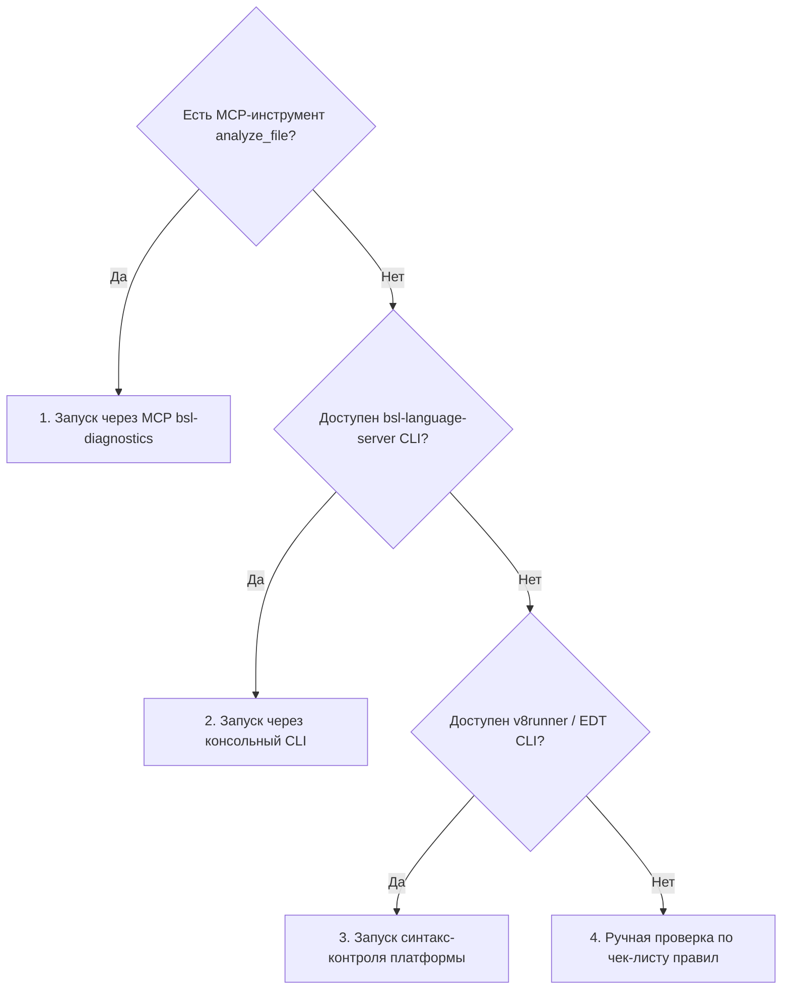

# Автоматическая диагностика BSL-кода

Скилл регламентирует выполнение статического анализа модулей 1С (BSL) и сценариев OneScript (OS) с фильтрацией результатов по границам изменений (diff).

---

## 1. Доступные механизмы анализа

Агент определяет доступный способ запуска статического анализа в следующем приоритете:



1. **MCP-инструмент (роль `bsl-diagnostics`):**
   - Инструмент `analyze_file` (сервер `user-bsl-mcp` или имя из `workflow/local.md`).
   - Принимает абсолютный путь к файлу `.bsl` / `.os`.
   - **Внимание:** при первом запуске в новой рабочей копии сервер индексирует корень конфигурации (до 1-2 минут). Операцию нельзя обрывать по таймауту.
2. **Консольный CLI (`bsl-language-server`):**
   - Запуск через Shell: `bsl-language-server analyze -c .bsl-language-server.json --src <путь-к-файлу>`.
   - Альтернативно через Java JAR: `java -jar <путь-к-jar> analyze -c .bsl-language-server.json -s <путь-к-файлу>`.
3. **Платформенный синтакс-контроль (v8runner / EDT CLI):**
   - Запуск штатного скрипта проекта (например, `v8runner syntax-check`).
4. **Ручная проверка (Fallback):**
   - Если инструменты анализа отсутствуют, агент проводит ручной аудит синтаксиса и структуры по правилам `rules/coding-standards.md`, обязательно указывая в отчете: *«Автоматическая проверка BSL Language Server не выполнялась из-за отсутствия линтера в среде»*.

---

## 2. Фильтрация и границы применимости

Диагностики линтера не принимаются «слепо». Агент применяет следующие фильтры:

### Фильтр 1. Зоны кода (`rules/project-context.md`)
- Диагностики в файлах сторонних вендоров и библиотек **игнорируются**.
- Диагностики внутри фреймворков тестирования (например, движок YAxUnit в каталоге `ЮТ*`) **игнорируются**.
- Диагностики учитываются только для проектного кода и тестов текущей задачи.

### Фильтр 2. Строки Diff
- При проверке задачи или MR/PR анализируются только **добавленные и измененные строки**.
- Диагностика на нетронутой строке legacy-кода признается замечанием к задаче **только если** она вызвана внесенными правками (например, удалена вызываемая процедура или изменен состав параметров экспортного метода).
- Существующие дефекты в окружающем коде фиксируются отдельно как информационные рекомендации (`[legacy-debt]`), но не блокируют приемку задачи.

### Фильтр 3. Версии и режимы совместимости
- Параметр `{PLATFORM_VERSION}` из `project-profile.md` определяет платформенные правила.
- Если проверяемый файл находится внутри расширения (`rules/project-context.md`), необходимо учитывать режим совместимости расширения: конструкции `Асинх` / `Ждать` недопустимы при режиме совместимости `< 8.3.18`.

---

## 3. Маппинг уровней важности (Severity)

Диагностики BSL Language Server сопоставляются с категориями код-ревью проекта:

| Severity линтера | Категория проекта | Статус замечания | Описание |
|---|---|---|---|
| `Error` | **CRITICAL** | `[blocking]` | Синтаксические ошибки, обращение к несуществующим методам/реквизитам, неверное число параметров |
| `Warning` (производительность) | **CRITICAL** / **HIGH** | `[blocking]` | Запрос в цикле, прямое чтение через точку от ссылки при БСП, фильтры ВТ в ГДЕ |
| `Warning` (архитектура/кодстайл) | **HIGH** / **MEDIUM** | `[blocking]` / `[nit]` | Устаревшие методы платформы, тернарный оператор, нарушение областей модуля |
| `Information` | **MEDIUM** / **LOW** | `[nit]` | Рекомендации по оформлению, избыточные скобки, неиспользуемые локальные переменные |
| `Hint` | **LOW** | `[nit]` | Советы по улучшению читаемости и документации |

---

## 4. Пошаговый алгоритм выполнения

1. **Сбор списка измененных файлов:**
   - Найти все файлы с расширениями `.bsl` и `.os` в диффе текущей ветки или рабочего каталога.
2. **Получение карты измененных строк:**
   - Для каждого файла определить список номеров добавленных/измененных строк.
3. **Запуск статического анализа:**
   - Вызвать `analyze_file` (или CLI) для каждого целевого файла.
4. **Сортировка и сопоставление диагностик:**
   - Отбросить срабатывания на неизмененных строках.
   - Отбросить срабатывания из файла исключений (`exceptionFile.txt`), если он настроен.
   - Сгруппировать оставшиеся диагностики по файлам и уровням severity.
5. **Формирование отчета:**
   - Оформить краткую сводную таблицу:

```markdown
### Результаты статического анализа BSL

| Файл | Строка | Код правила | Severity | Статус | Сообщение |
|---|---|---|---|---|---|
| `src/cf/src/Documents/ЗаказКлиента/Forms/ФормаДокумента/Ext/Form.Module.bsl` | 142 | `BSL:QueryInLoop` | Error | `[blocking]` | Обнаружен запрос внутри цикла |
| `src/cf/src/CommonModules/{PREFIX}РасчетСкидок/Ext/Module.bsl` | 56 | `BSL:TernaryOperator` | Warning | `[nit]` | Использование тернарного оператора ?(...) запрещено стандартом |
```
