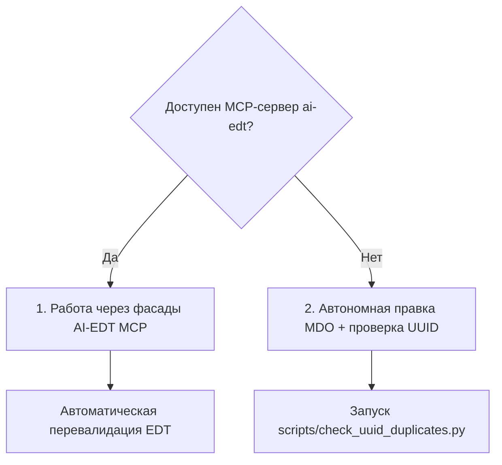

# Разработка и валидация метаданных 1С в формате EDT

Скилл регламентирует создание, изменение и валидацию объектов метаданных конфигурации и расширений 1С:Предприятие в формате исходных кодов **1C:Enterprise Development Tools (EDT)** (`*.mdo`, `Configuration.mdo`, `Form.form`).

---

## 1. Контекст проекта и параметры

Перед созданием или правкой объектов метаданных агент считывает:
- Префикс проекта: `{PREFIX}` из `project-profile.md` (см. `rules/metadata-naming.md`).
- Расположение исходников EDT: `{EDT_PROJECT_FORMAT}` из `project-profile.md` (например, `src/cf/src`).
- Целевое размещение доработок: `{NEW_OBJECTS_IN}` (`main_configuration` или `extension`).

---

## 2. Архитектура структуры объектов в формате EDT

В формате EDT каждый объект метаданных представляет собой директорию:

```text
{EDT_PROJECT_FORMAT}/
├── Configuration.mdo                          # Корневой дескриптор конфигурации
└── Catalogs/
    └── {PREFIX}Контрагенты/
        ├── {PREFIX}Контрагенты.mdo            # Дескриптор метаданных объекта
        ├── ObjectModule.bsl                   # Модуль объекта (при наличии)
        ├── ManagerModule.bsl                  # Модуль менеджера (при наличии)
        └── Forms/
            └── ФормаЭлемента/
                ├── Form.form                  # XML-дескриптор управляемой формы
                └── Module.bsl                 # Модуль формы
```

Каждый новый объект **обязан** быть зарегистрирован в `Configuration.mdo` в соответствующей секции (`<catalogs>`, `<documents>`, `<informationRegisters>` и т.д.) и включен как минимум в одну подсистему конфигурации.

---

## 3. Два режима работы: MCP AI-EDT и автономный



### Режим 1. При наличии MCP-сервера `ai-edt`

Если в окружении подключен MCP-плагин `ai-edt` (работающий внутри запущенного экземпляра 1C:EDT):
1. **Создание и модификация метаданных:** использовать фасад `edit_metadata`:
   - `edit_metadata operation=create_object` — создание нового объекта;
   - `edit_metadata operation=add_attribute` — добавление реквизита;
   - `edit_metadata operation=add_tabular_section` — добавление табличной части.
2. **Исследование структуры:** фасад `code_search` (`operation=find_symbols`, `operation=find_references`).
3. **Проверка ошибок проекта:** фасад `diagnostics` (`operation=revalidate_objects`, `operation=get_project_errors`).
4. Подробная документация по операциям плагина — в `references/ai-edt-facades.md`.

### Режим 2. Автономная работа (без MCP)

Если EDT не запущена или MCP-сервер отсутствует, агент создает и редактирует файлы MDO напрямую:
1. Создает каталог объекта по образцу соседнего объекта того же типа.
2. Генерирует дескриптор `<ИмяОбъекта>.mdo` с уникальными UUID.
3. Добавляет ссылку на объект в `Configuration.mdo`.
4. Добавляет объект в состав проектной подсистемы (`Subsystems/<Имя>/<Имя>.mdo`, блок `<content>`).
5. Создает заготовки модулей (`ObjectModule.bsl`, `ManagerModule.bsl`) с каноническими областями (`rules/module-structure.md`).
6. Запускает скрипт проверки уникальности UUID:
   ```bash
   python skills/edt-metadata/scripts/check_uuid_duplicates.py {EDT_PROJECT_FORMAT}
   ```

---

## 4. Критические правила целостности MDO-файлов

### Правило 1. Глобальная уникальность UUID

Каждый UUID в атрибутах `uuid`, `typeId`, `valueTypeId` **обязан быть уникальным** по всему проекту:
- **Категорически запрещено** копировать UUID из соседних файлов MDO.
- **Категорически запрещено** использовать последовательные/placeholder UUID (`00000000-0000...`).
- Генерация нового UUID:
  - Python: `uuid.uuid4()`
  - PowerShell: `[guid]::NewGuid()`
- При обнаружении дубликатов запустить автоматическое исправление:
  ```bash
  python skills/edt-metadata/scripts/check_uuid_duplicates.py --fix {EDT_PROJECT_FORMAT}
  ```

### Правило 2. Проверка существования ссылочных объектов

Перед добавлением ссылки на объект метаданных в:
- Подсистемы (`<content>Subsystem... / <content>Catalog...`);
- Планы обмена (`<content><mdObject>`);
- Подписки на события (`<source>`, `<event>`);
- Определяемые типы (`<type>`);
**Обязательно убедиться**, что целевой объект реально существует в проекте. Битая ссылка приводит к отказу загрузки: `Несоответствие свойства и элемента данных XDTO: Свойство: 'Metadata'`.

### Правило 3. Регистры сведений: ресурс или реквизит

- **Ресурс:** целевые бизнес-данные, идентифицируемые комбинацией измерений (значение, состояние, статус).
- **Реквизит:** контекст и обстоятельства появления записи (автор, дата фиксации, комментарий, идентификатор источника).
- **Внимание:** изменение типа поля (перенос из реквизитов в ресурсы и наоборот) после выкатки в базу приводит к удалению и повторному созданию колонки с потерей данных. Вид поля определяется на этапе проектирования.

### Правило 4. Стандартные атрибуты табличных частей

В табличных частях объектов блок `<standardAttributes><name>LineNumber</name>...</standardAttributes>` вручную **не добавляется** — платформа EDT генерирует его автоматически.

---

## 5. Требования к XML-формам в EDT (`Form.form`)

При ручном создании или правке `Form.form` учитывать ограничения (подробнее в `references/edt-form-requirements.md`):

1. **Root `extInfo`:** для форм обработок и отчетов обязателен корневой тег:
   ```xml
   <extInfo xsi:type="form:ObjectFormExtInfo"/>
   ```
2. **Блок интерфейса команд:** обязателен тег:
   ```xml
   <commandInterface>
     <navigationPanel/>
     <commandBar/>
   </commandInterface>
   ```
3. **Имя тега команд формы:** строго `<formCommands>`, а не `<commands>`.
4. **Сочетания клавиш (`<shortcut>`):**
   - Допустимы только модификаторы `Ctrl`, `Alt`, `Shift`.
   - Запрещена мак-нотация (`Cmd`, `Option`) — на Windows она превращается в обычную букву и ломает набор текста.
   - Основная клавиша — только из функционального F-ряда (`Shift+F<N>`), буквы и цифры запрещены.

---

## 6. Чек-лист проверки метаданных перед завершением задачи

- [ ] Имя объекта содержит префикс `{PREFIX}` (если он задан в `project-profile.md`).
- [ ] Реквизиты внутри проектного объекта созданы **без** повторного префикса.
- [ ] Объект зарегистрирован в `Configuration.mdo`.
- [ ] Объект включен в состав проектной подсистемы.
- [ ] Запущен `python skills/edt-metadata/scripts/check_uuid_duplicates.py`, дубликатов 0.
- [ ] Модули объекта содержат стандартные области `#Область` по канону `rules/module-structure.md`.
