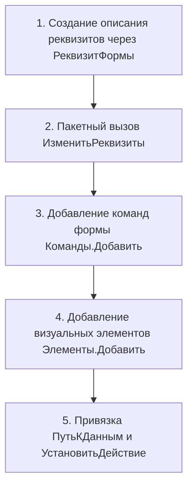

# Проектирование управляемых форм 1С

Скилл регламентирует проектирование компоновки, добавление элементов и реквизитов, а также написание серверного и клиентского кода модулей управляемых форм 1С:Предприятие.

---

## 1. Точки входа и правила проекта

- `rules/forms.md` - главный роутер для задач по управляемым формам.
- `rules/form-patterns.md` - проектирование визуальной компоновки и эргономики UI.
- `rules/forms-add.md` - правила создания структуры `Form.xml` и программной модификации.
- `rules/form-module.md` - канонические области и логика модуля формы (`Form.Module.bsl`).
- `rules/async-methods.md` - асинхронные обработчики (`Асинх` / `Ждать` против `ОписаниеОповещения`).

> **Важное ограничение по `Form.xml`:**  
> Ручная правка XML-дескриптора формы допускается только точечно. Для типовых объектов и расширений предпочтительна **программная модификация формы** в обработчике `ПриСозданииНаСервере` - это исключает повреждение структуры формы EDT/Конфигуратора.

---

## 2. Архитектура программной модификации (`ПриСозданииНаСервере`)

При добавлении проектных реквизитов и элементов интерфейса в существующую или новую форму соблюдается строгая последовательность:



### Пример добавления реквизита и поля ввода

```bsl
&НаСервере
Процедура {PREFIX}ПриСозданииНаСервере(Отказ, СтандартнаяОбработка)
	
	// Имя добавленного реквизита с проектным префиксом {PREFIX} (например, смк_КомментарийСогласования)
	ИмяРеквизита = "{PREFIX}КомментарийСогласования";
	
	// 1. Описание и добавление нового реквизита формы
	МассивРеквизитов = Новый Массив;
	ТипРеквизита = Новый ОписаниеТипов("Строка",,,, Новый КвалификаторыСтроки(100));
	МассивРеквизитов.Добавить(Новый РеквизитФормы(
		ИмяРеквизита,
		ТипРеквизита,
		,
		НСтр("ru = 'Комментарий согласования'")
	));
	ИзменитьРеквизиты(МассивРеквизитов);
	
	// 2. Добавление элемента на форму
	Родитель = Элементы.ГруппаШапка;
	ЭлементКомментарий = Элементы.Добавить(
		ИмяРеквизита,
		Тип("ПолеФормы"),
		Родитель
	);
	ЭлементКомментарий.Вид = ВидПоляФормы.ПолеВвода;
	ЭлементКомментарий.ПутьКДанным = ИмяРеквизита;
	ЭлементКомментарий.МногострочныйРежим = Истина;
	ЭлементКомментарий.ПоложениеЗаголовка = ПоложениеЗаголовкаЭлементаФормы.Верх;
	
	// 3. Подключение обработчика изменения
	ЭлементКомментарий.УстановитьДействие(
		"ПриИзменении",
		"{PREFIX}КомментарийСогласованияПриИзменении"
	);
	
КонецПроцедуры
```

---

## 3. Декларативная структура `Form.xml` (новые формы)

Для новых объектов метаданных структура элементов описывается в `Form.xml`.

### Подключение обработчиков событий в XML
Процедура в `Form.Module.bsl` вызывается платформой только при наличии соответствующей привязки в XML:

```xml
<Events>
	<Event name="OnCreateAtServer">ПриСозданииНаСервере</Event>
	<Event name="OnOpen">ПриОткрытии</Event>
	<Event name="BeforeWrite">ПередЗаписью</Event>
</Events>
```

Для элементов управления привязка событий внутри XML формы задается в блоке `<Events>` элемента:
```xml
<ContextMenu name="СписокКонтекстноеМеню" id="2"/>
<ExtendedTooltip name="СписокРасширеннаяПодсказка" id="3"/>
<Events>
	<Event name="Selection">СписокВыбор</Event>
</Events>
```

---

## 4. Стандарты модуля формы (`Form.Module.bsl`)

### 1. Канонический состав 5 областей `#Область`
Модуль формы обязан содержать ровно 5 обязательных областей согласно `rules/module-structure.md` (все 5 областей обязательны, даже пустые; для каждой ТЧ создается отдельная область):

```bsl
#Область ОбработчикиСобытийФормы
// ПриСозданииНаСервере, ПриОткрытии, ПередЗакрытием и др.
#КонецОбласти

#Область ОбработчикиСобытийЭлементовШапкиФормы
// Обработчики полей ввода, флажков, списков шапки
#КонецОбласти

#Область ОбработчикиСобытийЭлементовТаблицыФормы<ИмяТаблицы>
// Для каждой табличной части создается своя область, например:
// ОбработчикиСобытийЭлементовТаблицыФормыТовары
// ПриАктивизацииСтроки, ПередУдалением и т.д.
#КонецОбласти

#Область ОбработчикиКомандФормы
// Процедуры команд, привязанных к кнопкам
#КонецОбласти

#Область СлужебныеПроцедурыИФункции
// Внутренние серверные и клиентские алгоритмы формы
#КонецОбласти
```

### 2. Директивы компиляции и минимизация контекста
- **Приоритет директив:**
  - `&НаКлиенте` - только первичное взаимодействие с интерфейсом пользователя.
  - `&НаСервереБезКонтекста` - **предпочтительная директива** для всех серверных операций. Передаются только конкретные значения: ссылки, строки, структуры. Контекст формы не сериализуется через сеть.
  - `&НаСервере` - используется **только** тогда, когда требуется прямое изменение структуры формы, дерева элементов или реквизитов формы.
- **Запрет:** Вызовы тяжелых серверных методов `&НаСервере` в циклах обхода табличной части или на каждое нажатие клавиши.

### 3. Зарезервированные имена и свойства выбора
При динамической настройке связей выбора в коде используются строго штатные имена структур:
- `ПараметрыВыбора` - массив элементов `ПараметрВыбора`.
- `СвязиПараметровВыбора` - коллекция связей с реквизитами текущей строки или формы.
- `СписокВыбора` - предопределенный список доступных значений.

---

## 5. Чек-лист проверки формы

1. **Компоновка:**
   - Все поля логически сгруппированы (шапка, вкладки, табличная часть, подвал).
   - Основная таблица растягивается по вертикали и горизонтали.
   - Заголовки полей лаконичны, без сокращений и без буквы «ё».
2. **Производительность:**
   - Серверные вызовы из клиентских событий минимизированы и вынесены в `&НаСервереБезКонтекста`.
   - В `ПриСозданииНаСервере` реквизиты регистрируются одним общим вызовом `ИзменитьРеквизиты()`, а не множеством последовательных.
3. **Совместимость платформ:**
   - Если `{PLATFORM_VERSION} >= 8.3.18`, диалоговые окна вызываются через `Ждать ВопросАсинх(...)`.
   - Если `< 8.3.18`, используется `ПоказатьВопрос(Новый ОписаниеОповещения(...))`.
