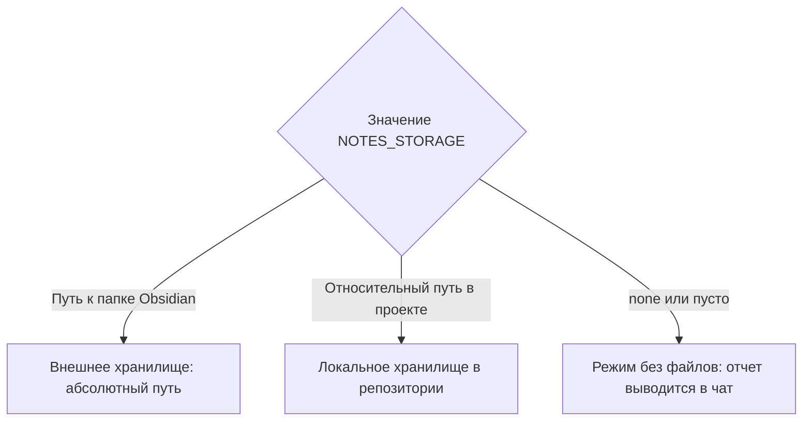

# Управление рабочими артефактами (Worklog, Analysis, ADR)

Скилл автоматизирует ведение технической документации и фиксацию затраченного времени при разработке в среде 1С:Предприятие в соответствии с регламентом `workflow/notes-artifacts.md`.

---

## 1. Режимы хранения (`{NOTES_STORAGE}`)

Перед созданием файлов агент проверяет настройку `{NOTES_STORAGE}` из `workflow/local.md`:



- **Внешнее хранилище:** файлы создаются по абсолютному пути (например, `C:\Users\username\Documents\ObsidianVault\1C-Projects\`).
- **Локальное хранилище:** файлы создаются внутри репозитория (например, `./docs/notes/`).
- **Режим `none`:** файлы на диске **не создаются**. Все разделы (анализ, лог сессии, ADR) выводятся в виде форматированного markdown прямо в диалог.

---

## 2. Три типа артефактов

Каталог `{NOTES_STORAGE}` структурирован по трем поддиректориям:

### 1. Предварительный анализ (`analyse/{КЛЮЧ}-{краткий-слаг}.md`)
Создается в начале работы над задачей:

```markdown
# Анализ задачи {КЛЮЧ}: {Краткое наименование}

- **Ссылка на тикет:** `{URL_ТИКЕТА}`
- **Дата анализа:** {ГГГГ-ММ-ДД}
- **Исполнитель:** {ИМЯ_РАЗРАБОТЧИКА}

## 1. Постановка проблемы и бизнес-цель
{Четкое описание того, какую проблему решает доработка}

## 2. Анализ объектов метаданных и связей
- `Документ.ЗаказКлиента` - добавление расчета статуса.
- `РегистрНакопления.ТоварыКОтгрузке` - проверка блокировок остатков.

## 3. Гипотезы и узкие места
- Риск деградации производительности при проведении в Managed Lock.
- Необходимость совместимости с расширениями.

## 4. Пошаговый план решения
1. Разработать экспортный метод расчета в общем модуле.
2. Покрыть метод unit-тестами на YAxUnit.
3. Доработать форму документа.
```

---

### 2. Единый накопительный журнал работы (`worklog/{КЛЮЧ}.md`)

> **Критическое правило:**  
> **Один файл на задачу на все время ее выполнения.** Запрещено создавать отдельные файлы на каждый день или сессию. Новая сессия всегда дописывается в конец существующего файла.

В конце каждой рабочей сессии агент дописывает в файл секцию:

```markdown
## Сессия {ГГГГ-ММ-ДД}
Время: ~{Длительность, например: 45 мин / 1 ч 30 мин}

### Что сделано
- Разработана процедура расчета скидок в общем модуле `{PREFIX}РасчетСкидокСервер`.
- Оптимизирован запрос расчета остатков (устранен подзапрос в списке выборки).
- Написано 3 unit-теста в тестовом модуле `{PREFIX}ТестыРасчетаСкидок`.

### Затронутые объекты метаданных
- `ОбщийМодуль.{PREFIX}РасчетСкидокСервер`
- `Документ.РеализацияТоваровУслуг`

### Осталось сделать / Вопросы
- [ ] Согласовать алгоритм округления копеек с аналитиком.
- [ ] Проверить время проведения документа под нагрузкой.
```

---

### 3. Архитектурное решение (`Architecture/{КЛЮЧ}-{краткий-слаг}.md`)

Оформляется при принятии архитектурных решений (выбор типа объекта, схемы блокировок, разделения на расширения):

```markdown
# ADR {КЛЮЧ}: {Название архитектурного решения}

- **Статус:** `Предложено` / `Принято` / `Отклонено`
- **Дата:** {ГГГГ-ММ-ДД}

## 1. Контекст и проблема
{Почему возникла необходимость выбора архитектурного подхода}

## 2. Рассмотренные варианты

### Вариант 1: Периодический регистр сведений
- **Плюсы:** Быстрое получение среза последних, простота выборки.
- **Минусы:** Нагрузка на итоги при высокой частоте записей.

### Вариант 2: Документ с табличной частью
- **Плюсы:** История изменений с авторством, проведение в транзакции.
- **Минусы:** Избыточность данных.

## 3. Принятое решение и обоснование
Выбран Вариант 1, так как частота обновлений не превышает 100 записей в день, а критичным фактором является время чтения на форме.

## 4. Влияние на систему 1С
- Нагрузка на СУБД: минимальная.
- Режим блокировок: Managed Lock по измерению `Организация`.
```

---

## 3. Сценарии вызова скилла

1. **Старт новой задачи:**
   - Извлечь `{КЛЮЧ}` из названия ветки или запроса пользователя.
   - Сформировать файл `analyse/{КЛЮЧ}-{слаг}.md`.
   - Инициализировать файл `worklog/{КЛЮЧ}.md` с вводным заголовком.
2. **Завершение сессии или дня:**
   - Оценить выполненные за сессию изменения по `git status` и `git diff`.
   - Подсчитать приблизительное время сессии.
   - Дописать новую сессию в `worklog/{КЛЮЧ}.md`.
3. **Фиксация выбора реализации:**
   - Создать файл `Architecture/{КЛЮЧ}-{слаг}.md` с фиксацией плюсов, минусов и влияния на платформу 1С.
